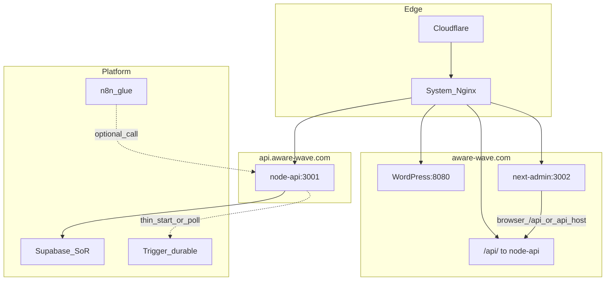
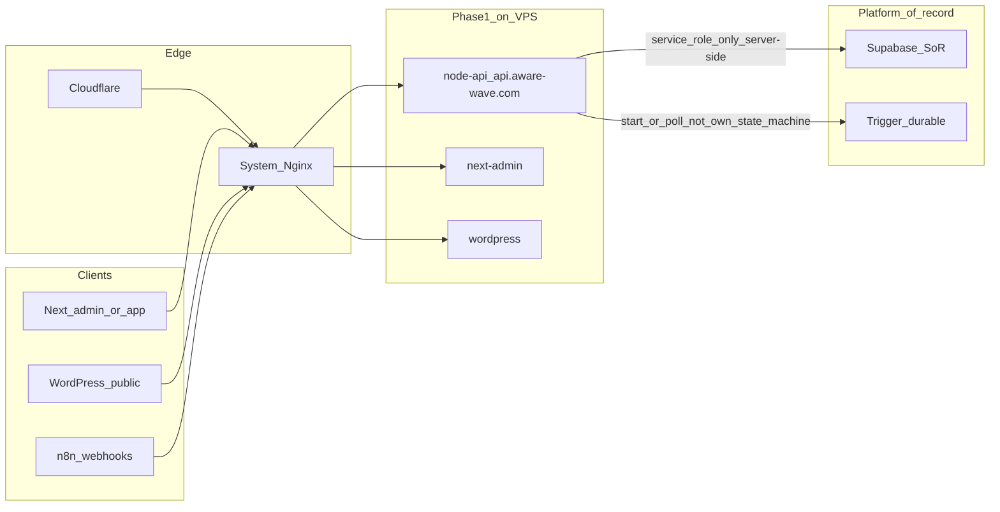

> **Owner（git SSOT）**：本檔為 `api.aware-wave.com`／phase1 **`node-api`** 邊界、路由演進與驗收之**唯一長篇正文**。  
> **統管入口**（子網域、DNS、Nginx、相關連結）：[`README.md`](README.md)。  
> **不要**在 `~/.cursor/plans/` 另存一份相同正文；若 IDE 留有舊 `.plan.md` 全文，以本路徑為準更新，舊檔改 stub 或刪除。

# `api.aware-wave.com` 詳盡用途與演進計畫

## 0. 計畫治理（避免多處重工與矛盾）

| 角色 | 檔案 |
|------|------|
| **API／`node-api`／子網域邊界 — 唯一執行正文** | 本檔 |
| **統管入口（主機名／連結匯總）** | [`README.md`](README.md) |
| **DNS／TLS／子網域操作表** | [`../operations/CLOUDFLARE_HETZNER_PHASE1.md`](../operations/CLOUDFLARE_HETZNER_PHASE1.md) |
| **平行 workstream** | 觀測／告警：[`../operations/SENTRY_ALERT_POLICY.md`](../operations/SENTRY_ALERT_POLICY.md)；規則：[`../operations/rules-version-and-enforcement.md`](../operations/rules-version-and-enforcement.md) |

原則：不把「規則治理」「全庫 DR」與「API 路由交付」硬 merge 成單檔；**API 交付**以本檔與下方 Checklist 為準。

---

## 1. 定位（這個子網域在整體裡是什麼）

- **技術對應**：Cloudflare → 系統 Nginx → 本機 **`127.0.0.1:3001`** → Docker **`lobster-node-api`**（[`lobster-factory/infra/hetzner-phase1-core/apps/node-api/src/index.js`](../../../lobster-factory/infra/hetzner-phase1-core/apps/node-api/src/index.js)）。
- **戰略用途（預設，與 repo 一致）**：**內部與受控的 HTTP API 邊界（BFF / integration edge）**——給 **`next-admin`**、未來 **Internal Ops 控制台**（見 [`../../TASKS.md`](../../TASKS.md)）、以及 **n8n／Trigger 伺服器側** 呼叫；**不是**預設對匿名公眾開放的「產品開放平台」。若未來要對外，需 **新 ADR**（金鑰、配額、資料分類、與 service role 隔離）。
- **與 apex 路徑的關係**：公開站 **`aware-wave.com`** 上 Nginx 仍將 **`/api/`** 指到同一 `node-api`（見 [`lobster-factory/infra/hetzner-phase1-core/nginx/system-sites/lobster-aware-wave-locations.inc`](../../../lobster-factory/infra/hetzner-phase1-core/nginx/system-sites/lobster-aware-wave-locations.inc)）。因此存在 **兩個合法入口**：**路徑型** `https://aware-wave.com/api/...` 與 **主機型** `https://api.aware-wave.com/...`。計畫上應 **版本化與文件化**兩者對應關係，避免團隊以為只有其中一個「才是正統」。

### 1.1 「30 年穩定」在 API 層的意義（精簡）

穩定 **≠** 程式永不改；而是 [`LONG_TERM_OPS.md`](../../../lobster-factory/infra/hetzner-phase1-core/LONG_TERM_OPS.md) 所寫：**可替換零件、可審計流程、可演練還原、staging 先行**。API 層表現為 **邊界清楚、版本可演進、觀測與回滾可驗證**，而非把商業邏輯塞進單一 Express 檔。

### 1.2 預設第一類消費者（依 repo 證據；寫入 `node-api` README）

下列為 **預設假設**；若與未來商業決策不一致，以 **新 ADR 或 README 一句覆寫** 即可（不當成對話必答題）。

- **主路線**：**內部與受控呼叫方**——`next-admin`（`/admin`）、未來 **Internal Ops 控制台**（TASKS 已列）、n8n／Trigger 經 Nginx **伺服器側** 呼叫 `node-api`。**不是**預設對外公開給任意 mobile／匿名流量（該路線需 rate limit、金鑰、資料分類 ADR）。
- **Auth 預設**：與 **ADR 002（Clerk）** 與 Enterprise 工具層敘事一致——**B2B 營運身分**由 Clerk／JWT 在 `node-api` 驗簽；**不**預設自建帳密 DB 為主身分。
- **`app.aware-wave.com`**：與目前 Nginx 範本一致，視為 **導向 apex `https://aware-wave.com/admin/` 的入口**（書籤／短網址），**不**預設為第二套獨立前端主機，除非另開 ADR。

### 1.3 功能分層（層 0／1／2）與本計畫 P0～P4 對照

| 分層 | 含義 | 對應本計畫 |
|------|------|------------|
| **層 0** | 營運與契約：存活／就緒、meta、Sentry、版本前綴、OpenAPI 雛形 | **P0**（`/v1/health`、`/v1/ready`、`/v1/meta`、README、openapi） |
| **層 1** | 內部 BFF：Clerk、CORS、Trigger 薄代理、Supabase 窄代理、Webhook 入站、Redis 冪等／限流 | **P1～P3** |
| **層 2** | 對外產品 API（可選） | **P4**；**預設不啟動**，先 ADR 再路由 |

## 2. 現況盤點（已具備／缺口）

| 項目 | 狀態 |
|------|------|
| DNS / CF / Nginx `api` → 3001 | 你已架好；範本見 [`aware-wave-app-api-subdomains.conf`](../../../lobster-factory/infra/hetzner-phase1-core/nginx/system-sites/aware-wave-app-api-subdomains.conf) |
| `GET /health` | 已存在；compose healthcheck 依賴此端點 |
| `GET /rag/*` | 已存在（探測 OpenAI／Supabase）；偏 **營運／除錯**，不應無限制當「公開產品 API」 |
| Redis `REDIS_URL` | compose 已注入；`index.js` **尚未使用**（預留 rate limit、idempotency、session 外掛） |
| 版本前綴、OpenAPI、Clerk 驗簽、Trigger 薄代理 | **尚未**；屬本計畫主交付 |

## 3. 邊界憲法（任何新路由不得違反）

| 規則 | 正本 |
|------|------|
| 耐久編排、重試、核准 | **Trigger**；n8n 僅黏著 | [ADR 004](../architecture/decisions/004-trigger-vs-n8n-orchestration-boundary.md) |
| 結構化真相、RLS | **Supabase**；WP 為站內執行期 | [ADR 005](../architecture/decisions/005-supabase-sor-vs-wordpress-runtime-db.md) |
| B2B 身分 | **Clerk**（控制台路線） | [ADR 002](../architecture/decisions/002-clerk-identity-boundary.md) |
| 長期營運節奏 | RPO/RTO、備份、升級 staging 先行 | [`LONG_TERM_OPS.md`](../../../lobster-factory/infra/hetzner-phase1-core/LONG_TERM_OPS.md) |

**`node-api` 不擁有**：長狀態機、人工核准等待佇列、跨日重試排程（→ Trigger）；**不擁有**跨租戶報表真相（→ Supabase 查詢／物化視角）。

**白話**：`api.aware-wave.com` 可長 REST，但 **「狀態機式、要回放、要等人核准」** 仍落 **Trigger**；**「跨客戶、RLS、報表」** 仍落 **Supabase**；站內內容／外掛偏 **WordPress**（對齊 ADR 005）。

## 4. 分階段路線圖（建議順序與驗收）

### 階段 P0 — 契約與可觀測（1～3 個迭代內完成）

- **路由版本**：新增 **`/v1/health`**（可與 `/health` 並存一段過渡期）、**`GET /v1/meta`**（`service`、`git_sha`、`build_time` — Dockerfile build-arg 注入）。
- **就緒探針**：**`GET /v1/ready`** — 依序檢查 `SUPABASE_*`、（可選）Redis `PING`、關鍵 env；失敗回 **503** 與結構化 JSON（不含密鑰）。
- **文件**：在 [`apps/node-api/`](../../../lobster-factory/infra/hetzner-phase1-core/apps/node-api/) 新增 **README**：擁有／不擁有、**§1.2 預設消費者**、與 apex `/api/` 雙入口對照、**service role 永不下發瀏覽器**。
- **OpenAPI**：新增最小 **`openapi.yaml`**（先含 `/v1/health`、`/v1/ready`、`/v1/meta`）；CI 或 `verify-build-gates` 可選接「契約檔存在」檢查（與現有 Sentry 契約 gate 同級思維）。
- **營運地基（零功能也有價值）**：每個新路由 **Sentry tag**；敏感路徑不落 log 本體；監控優先打 **`/v1/ready`**（見 [`SENTRY_ALERT_POLICY.md`](../operations/SENTRY_ALERT_POLICY.md)）；**VPS 目錄**收斂為可 `git pull` 或 CI artifact（與下方 Checklist「可重現 deploy」一致）。
- **驗收**：`curl` **apex** `.../api/health` 與 **子網域** `https://api.aware-wave.com/v1/ready` 行為符合預期；Sentry 可見路由 tag。

### 階段 P1 — 內部身分與邊界（與 TASKS「控制台／Enterprise」銜接）

- **Clerk JWT 中介層**：Express middleware：**驗簽** → 解析 `org`／`user` → 注入 `req.auth`；**未帶合法 JWT 的 `/v1/*`（除 health/ready/meta）** 回 **401**。
- **CORS**：白名單 **`https://aware-wave.com`**（含 `/admin` 來源）、必要時 staging 主機；**禁止** `*` + credentials 組合踩雷。
- **`/rag/*` 收斂**：改掛 **`/v1/internal/rag/*`** 或加 **JWT + IP 限制**；對外公開文件中標 **internal**，避免被誤當產品 API。

### 階段 P2 — BFF：Trigger／Supabase 窄能力

- **Trigger 薄代理**（範例契約）：`POST /v1/trigger/runs`（body：已知 `taskId`／payload）、`GET /v1/trigger/runs/:id`（輪詢或讀 SoR）；**禁止**在 `node-api` 內複製 Trigger 狀態機。
- **Supabase 代理**：僅對 **已存在 RLS 政策** 或 **明確允許 service role 的讀寫** 暴露少量路由；優先推 **客戶端 anon + RLS**，`node-api` 只補「無法安全下發到瀏覽器」的洞。
- **Redis 使用**：**idempotency key** 儲存（webhook）、**每 JWT 每分鐘 rate limit**（防營運腳本誤傷 API）。

### 階段 P3 — Webhook 入站（與 n8n 分工）

- **`POST /v1/webhooks/:provider`**：驗簽（HMAC／timestamp／replay window）→ idempotency → **轉發 n8n** 或 **啟動 Trigger**（依事件類型配置表）；**業務規則**在 SoR 或 Trigger 內完成。
- **出站 webhook**（若需要）：delivery 與重試以 **Trigger 或 SoR 表** 為準，避免 Express「發了就算」。
- **驗收**：偽造簽章 **401**；重送同 key **409** 或 **200 冪等**（事先寫死契約）。

### 階段 P4 — 可選：對外公開 API（僅在商業需要時）

- **前置**：新 ADR — API key 或 OAuth、配額、日誌保留、個資分類、與 Clerk 內部路由分離。
- **實作**：獨立 **`/public/v1`** 或 **獨立 service**（較乾淨），避免與內部 `service role` 路徑混在同一 middleware 鏈上難以審計。

## 5. 與前端的連線策略（避免雙入口踩雷）

- **現狀**：`next-admin` 使用 **`NEXT_PUBLIC_API_BASE_PATH: /api`**，瀏覽器打 **同源 `/api/...`**（見 [`docker-compose.yml`](../../../lobster-factory/infra/hetzner-phase1-core/docker-compose.yml)）。
- **建議演進**（擇一寫進 README 並貫徹）：
  - **A（保守）**：瀏覽器繼續用 **`/api/`**；**`api.aware-wave.com`** 給 **伺服器對伺服器**、CLI、合作方（未來）。
  - **B（統一主機型）**：`NEXT_PUBLIC_API_BASE_URL=https://api.aware-wave.com`，CORS + Clerk 允許來源一併調整；好處是 **Cookie／第三方整合** 語意清楚。

## 6. 營運與安全（與功能同等重要）

- **監控**：Cloudflare Health Check 或 Uptime 指向 **`/v1/ready`**；Sentry 告警見 [`SENTRY_ALERT_POLICY.md`](../operations/SENTRY_ALERT_POLICY.md)。
- **日誌**：禁止 raw body 含 PII；request id **correlation**（`X-Request-Id`）。
- **部署**：解決 **VPS 目錄非 git** 漂移（`WORKLOG` 已記）— 目標為 **可重現 deploy**（`git pull` + `compose build node-api` 或 CI artifact）。

## 7. 明確排除（降低 30 年技術債）

- 在 `node-api` 內實作 **完整業務 workflow**（應在 Trigger）。
- 以 **WP meta** 作跨站 **唯一真相**（違 ADR 005）。
- 無版本、無 auth 的 **萬用 CRUD** 堆疊；無 OpenAPI、無身分邊界的 **「萬用 /api」** 與 apex `/api/`、子網域根路徑語意重疊持續堆疊。

## 8. 建議里程碑摘要

| 階段 | 核心產出 | 驗收 |
|------|-----------|------|
| P0 | `/v1/*`、ready、meta、README（含 §1.2）、OpenAPI 雛形、營運／VPS 對齊 | 雙入口 curl + Sentry |
| P1 | Clerk middleware、CORS、rag 收斂 | 無 JWT 拒絕、有 JWT 可通 |
| P2 | Trigger 薄代理、Supabase 窄代理、Redis 限流 | 不複製 Trigger 狀態 |
| P3 | Webhook 驗簽 + 冪等 | 偽簽／重放行為符合契約 |
| P4 | 可選公開 API | ADR + 分離路由或服務 |

## 9. 附：邊界架構圖（LR，與 §1 TB 圖互補）

## 10. 執行待辦（Checklist）

與實作同步時可複製到 [`../../TASKS.md`](../../TASKS.md)；完成項在此打勾或改以 TASKS 為準（擇一，避免雙邊漂移）。

- [ ] **P0**：新增 `/v1/health`、`/v1/ready`、`/v1/meta`；Dockerfile build-arg 注入 git sha；保留 `/health` 過渡。
- [ ] **P0**：`apps/node-api` README + `openapi.yaml` 雛形；寫死 §1.2；說明 apex `/api/` 與 `api` 子網域雙入口。
- [ ] **P0**：`WORKLOG`／營運落實 `LONG_TERM_OPS`；`api` 納入監控與還原演練。
- [ ] **P1**：Clerk JWT middleware、CORS 白名單、`/rag` 收斂為 `/v1/internal/rag` 或 JWT+IP。
- [ ] **P2**：Trigger 薄代理、Supabase 窄代理、Redis idempotency + rate limit。
- [ ] **P3**：`POST /v1/webhooks/:provider` 驗簽 + 冪等 + 轉發 n8n/Trigger。
- [ ] **Deploy**：VPS phase1 可追蹤 repo；監控改打 `/v1/ready`。
- [ ] **P4（可選）**：對外公開 API 時新 ADR + `/public/v1` 或獨立服務。
