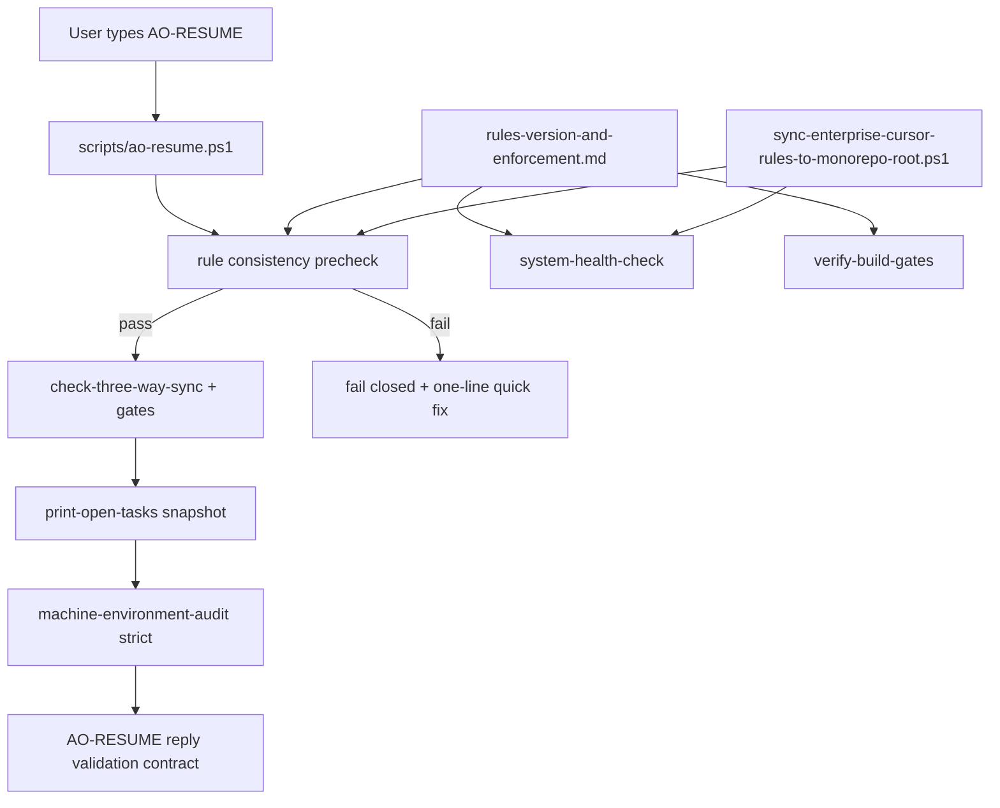

> **Owner**：規則治理「收斂」視角與 DoD。對應舊 Cursor 檔名 **`30-year-rule-consolidation_*.plan.md`**。  
> **與** [`PLAN_RULES_STABILITY_CONSOLIDATION.md`](PLAN_RULES_STABILITY_CONSOLIDATION.md) **同軌**；執行時以 [`rules-version-and-enforcement.md`](../operations/rules-version-and-enforcement.md) 為憲法正文。

# 30 年穩定規則治理收斂計畫

## 目標

把目前分散在多檔的規則與流程，收斂成「單一正本 + 自動驗證 + 可回滾」體系，確保未來新增規則不會被舊習慣覆蓋。

## 收斂原則

- **Single Owner**：一個決策只有一份正文；其餘檔案只放摘要+連結。
- **Executable Governance**：規則不是文字建議，必須有腳本與 gate 驗證。
- **Fail-Closed**：關鍵一致性檢查失敗就中止流程，不允許帶病前進。
- **Drift Detection**：每次 AO-RESUME/AO-CLOSE、health、build-gates 都檢測漂移。
- **Incremental Migration**：先收斂可執行層，再收斂歷史文檔，避免大爆炸重構。

## 目標範圍（Phase 1）

先處理「可執行運營層」：

- `.cursor/rules/*`（根與 `agency-os`）
- `scripts/ao-resume.ps1`、`scripts/sync-enterprise-cursor-rules-to-monorepo-root.ps1`
- `scripts/system-health-check.ps1`、`scripts/verify-build-gates.ps1`
- `AGENTS.md`、`README.md`、`docs/overview/REMOTE_WORKSTATION_STARTUP.md`
- [`rules-version-and-enforcement.md`](../operations/rules-version-and-enforcement.md)（Owner）

## 目標架構

## 執行步驟

1. **建立規則憲法（Owner）**：以 `rules-version-and-enforcement.md` 定義版本、優先級、硬失敗條件、變更流程。
2. **把規則變成可執行檢查**：`ao-resume.ps1` 開頭強制驗證：Owner 版本存在 + rules mirror VerifyOnly 必須通過。
3. **強化 AO-RESUME 回報契約**：`30-resume-keyword.mdc` 明確：未全列 `- [ ]` 任務即無效回覆，必須重出。
4. **索引與入口去重**：`cursor-enterprise-rules-index.md`、兩份 `rules/README.md` 僅保留摘要與 Owner 連結。
5. **自動檢查與健康閘道整合**：doc-sync / health / verify-build-gates 都驗證同一套 mirror 與版本規範。
6. **變更留痕與回滾節點**：更新 `TASKS.md`、`WORKLOG.md`、`memory/CONVERSATION_MEMORY.md`、`memory/daily/YYYY-MM-DD.md`；里程碑 checkpoint commit + gate 驗證後再決定 push。

## 驗收標準（DoD）

- AO-RESUME 在規則不一致時必定 fail closed，且給單行修復指令。
- AO-RESUME 回報必含全部未完成 `- [ ]` 任務（與 snapshot Total open 一致）。
- root 與 `agency-os` 規則鏡像一致性可由腳本自動驗證。
- `system-health-check` 與 `verify-build-gates` 皆 PASS。
- 關鍵規則變更都有 `TASKS` / `WORKLOG` / `memory` 證據鏈。

## Phase 2（後續，非本輪）

- 盤點 `docs/spec/raw` 與運營規則的重複段落。
- 把歷史長文改為「摘要 + Owner 連結」，逐步降低文檔漂移風險。
- 建立季度規則稽核（檢測重複 Owner、失效路徑、衝突敘述）。

## 歷史 todos 快照（自原 plan；狀態以 TASKS 為準）

| id | 說明 | 原狀態 |
|:---|:---|:---:|
| owner-spec | 確立 rules-version-and-enforcement 為單一正文 | cancelled |
| runtime-guard | ao-resume.ps1 規則版本/鏡像 precheck | cancelled |
| resume-contract | 30-resume-keyword.mdc 硬規則 | cancelled |
| index-linkage | rules README / index 摘要+Owner | cancelled |
| gate-validation | doc-sync / health / verify | completed |
| evidence-writeback | TASKS/WORKLOG/memory/daily | cancelled |
